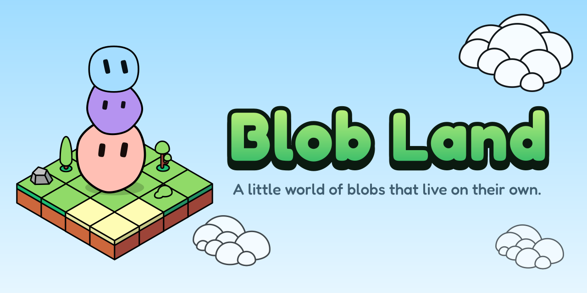

<p align="center">
  
</p>

<p align="center">
  <b>A little world of blobs that live on their own.</b><br>
  Name a blob, give it an island, and watch it live.
</p>

<p align="center">
  <a href="https://github.com/PerretWilliam/blob-land/actions/workflows/build.yml"></a>
  <a href="LICENSE"></a>
  
</p>

---

## What is it?

Blob Land is a desktop app about a blob that lives a life of its own. You don't control it: it sleeps, wanders, explores, makes friends, falls in love, has children, argues and makes up, and you get to watch.

- **Your blob, from its name.** Pick a name and your blob appears, drawn by [blobatar](https://blobatar.dev). Same name, same blob, always.
- **Your own island.** It lives on a floating island you can shape as you like: grass, sand, snow, rivers, roads, hills, trees, rocks. It works offline, with no account.
- **The garden.** When you're ready, join the shared garden: islands full of other players' blobs, living together. Blobs meet, gather in little groups, fall for each other and start families, and the garden's news tells you who did what.
- **Always living.** Close the app and your blob carries on. Come back to its journal to see what it's been up to.
- **Yours to choose.** Who your blob is and who it falls for, what the garden sees of it (or nothing at all), and the language the app speaks: English or French, with more to come. You can leave the garden for good whenever you like.

## The rules of the game

Blob Land keeps a few promises: blobs live their own lives, being away never hurts, players can't be unkind to each other, nothing is for sale. They're written down in [The Blob Land way](CONTRIBUTING.md#the-blob-land-way), and every change to the game keeps to them.

## How it's built

A pnpm monorepo in TypeScript:

| Package | What it is |
| --- | --- |
| [`apps/desktop`](apps/desktop) | The app: Tauri, React, and a PixiJS (WebGL) world |
| [`apps/api`](apps/api) | The garden's server: Node (Hono) on Postgres (Drizzle), self-hosted with Docker |
| [`packages/sim`](packages/sim) | The simulation, pure TypeScript, shared by the app and the server |

[docs/ARCHITECTURE.md](docs/ARCHITECTURE.md) has the stack and the data model, [docs/DECISIONS.md](docs/DECISIONS.md) the reasoning behind the choices already made, and [docs/PERFORMANCE.md](docs/PERFORMANCE.md) the frame-rate targets and how they're measured.

## Development

```bash
pnpm install
cp apps/api/.env.example apps/api/.env                   # once
docker compose -f apps/api/docker-compose.yml up -d db   # Postgres
pnpm dev                                                 # API + desktop app, in parallel
pnpm -r test
```

Each package also has its own README with package-specific commands; hosting your own garden server is in [apps/api](apps/api/README.md#self-hosting). The icon and banner are drawn by `pnpm --filter @blob-land/desktop brand`.

## Contributing

Contributions are welcome. Read [CONTRIBUTING.md](CONTRIBUTING.md) first: it starts with the rules of the game.

## Credits

Blob Land is made by [William Perret](https://github.com/PerretWilliam). The blobs are drawn by [blobatar](https://blobatar.dev), by Alain; the islands by Zagorskiy's isometric sprite pack; the lettering is Fredoka. Everyone and everything it's built on is listed in [CREDITS.md](CREDITS.md).

## License

Blob Land is free to play, read, change and share, but not to sell. In short:

- ✅ Use it, study it, change it and share it, for free, for anything noncommercial.
- ✅ Fork it to contribute back.
- ❌ Don't sell it, charge for it or make money with it.
- ❌ Don't publish a copy of it as your own separate project.
- ✍️ Credit it: "Based on Blob Land by William Perret", with a link here.

That's a summary; the [LICENSE](LICENSE) (the PolyForm Noncommercial License 1.0.0, with a few additional terms) is what counts. Third-party parts keep their own licenses, listed in [CREDITS.md](CREDITS.md).
